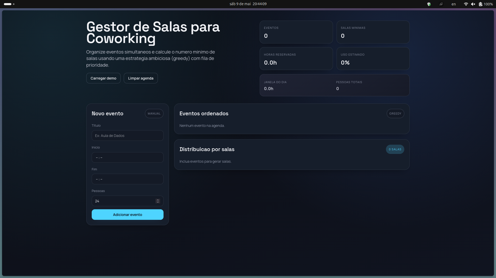
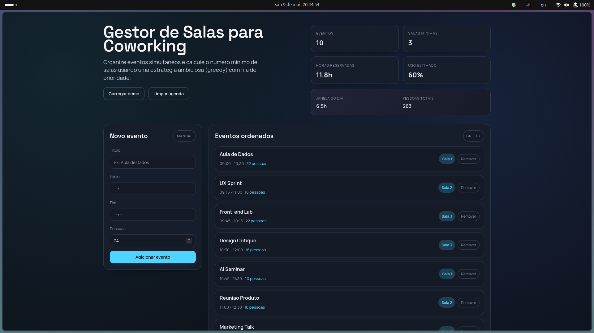
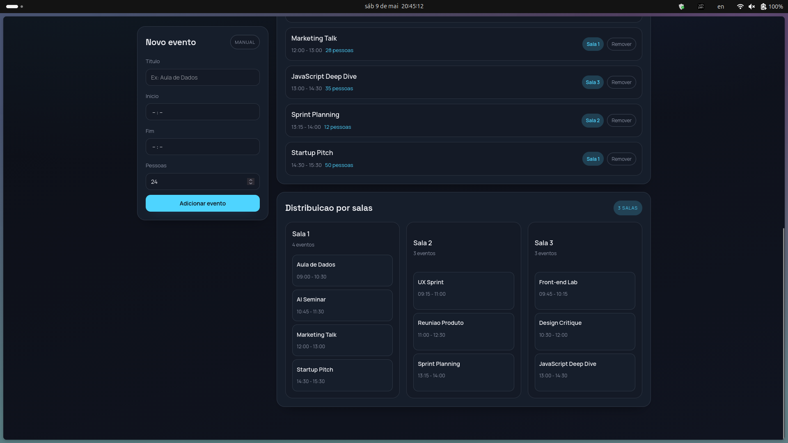

# Gestor de Salas - Interval Partition

Conteudo da Disciplina: Algoritmos Ambiciosos<br>

## Alunos

| Matricula | Aluno                     |
| --------- | ------------------------- |
| 211061583 | Daniel Rodrigues da Rocha |
| 211061618 | Davi Rodrigues da Rocha   |

## Sobre

O Gestor de Salas é focado em organizar eventos simultaneos sem conflito
de horario. A aplicacao utiliza o algoritmo de Interval Partition para
calcular o numero minimo de salas necessarias e distribuir os eventos de forma
eficiente.

Com isso, o projeto aplica conceitos de escalonamento e filas de prioridade em
uma interface web simples para simulacao de reservas em coworking ou salas de
aula.

## Screenshots







## Instalacao

Linguagem: JavaScript<br>
Framework: React + Vite<br>

### Pre-requisitos

1. Node.js 20.19+ (recomendado: Node.js 22)
2. npm (instalado junto com o Node)

### Passo a passo

1. Clone o repositorio:

```bash
git clone https://github.com/projeto-de-algoritmos-2026/G11_Greedy_PA-26.1.git
```

2. Entre na pasta do projeto:

```bash
cd G11_Greedy_PA-26.1
```

3. Instale as dependencias:

```bash
npm install
```

4. Inicie o frontend:

```bash
npm run dev
```

5. Abra no navegador:

```text
http://localhost:5173
```

## Uso

1. Com o frontend rodando, abra `http://localhost:5173`.
2. Clique em **Carregar demo** para popular com eventos de exemplo.
3. Adicione eventos manualmente com titulo, horario e quantidade de pessoas.
4. O sistema calcula automaticamente o numero minimo de salas.
5. Remova eventos quando necessario e veja a redistribuicao imediata.

## Outros

- Dados ficam em memoria (sem banco de dados persistente).
- O algoritmo de Interval Partition esta em `src/utils/intervalPartition.js`.

# Video de Apresentacao\
Em breve.
